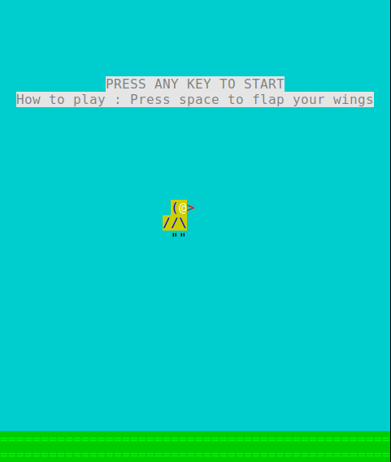

# Flappy-ASCII 🐦

Flappy-ASCII is a **terminal-based clone of Flappy Bird** written in **C**, made as a hobby project to learn **game programming**, practice **C programming**, and have some fun!

## Table of Contents
- [Features](#features)
- [Demo](#demo)
- [Requirements](#requirements)
- [Usage](#usage)
- [How it works](#how-it-works)


## 🚀 Features
- ASCII graphics in the terminal 🎨  
- Simple Flappy Bird mechanics (jump to avoid obstacles)  
- Runs in Linux/macOS terminal  
- Fully written in C with **Makefile support**

  
## 🎨 Demo
Here’s a simple idea of how it looks when running:


## 🧰 Requirements
Make sure you have:
- **gcc** (or another C compiler)
- **make**
- A **Linux** terminal (tested on Linux Mint)

## ⚙️ Installation

1. **Clone the repository**
```
git clone https://github.com/<your-username>/flappy-ascii.git
cd flappy-ascii
```

2. **Build the project**
```
make all
```
The executable will be created in a `build/` folder.

## 🎮 Usage
Run the game using:
```
make run
```
Or manually using:
```
./build/flappy-ascii
```
**Controls:**  
- Press **Space** to make the bird jump  
- Avoid the obstacles!  

## 📝 How it works
- Written entirely in **C** using standard libraries for terminal input/output.  
- Object files are generated in the `build/` folder using the **Makefile**.  
- The game loop handles:
  - Reading input  
  - Updating game state  
  - Printing ASCII frames in the terminal  
- The project was designed as a learning exercise to practice **C programming**, **game loops**, and **terminal graphics**.

